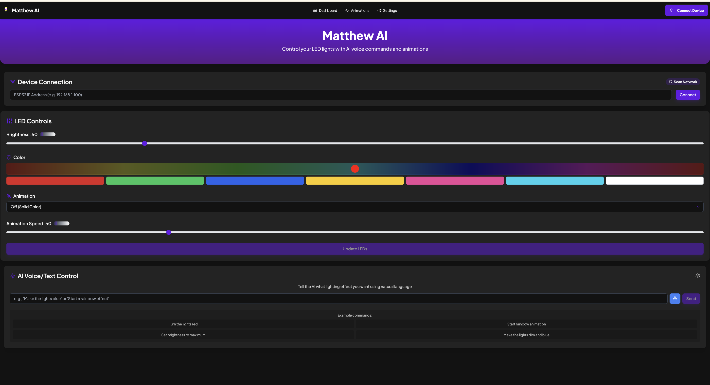
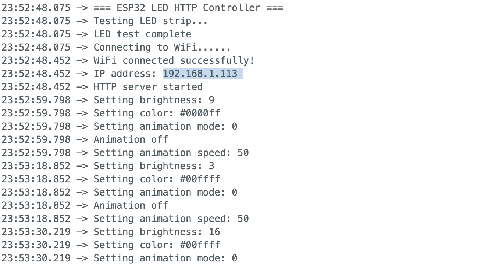

# Matthew AI LED Controller


A smart LED controller for WS2813 LED strips with AI voice commands, built with ESP32, React, TypeScript, and Azure OpenAI services.

## Overview

Matthew AI provides an intuitive web interface to control your LED strip with voice commands and visual controls. Using Azure OpenAI for natural language understanding, users can control colors, brightness, animations, and more with simple voice instructions.

## Screenshots

### Web Interface


### ESP32 Serial Monitor Output


## Features

- ✅ Local network LED control - Control your LED strips from any device on your local network
- ✅ AI Integration - Use natural language to control your lights with Azure OpenAI
- ✅ Voice Commands - Speak to your lights for hands-free control
- ✅ Multiple animations - Choose from various animation patterns
- ✅ Color presets - Quick access to common colors
- ✅ Responsive design - Works on desktops, tablets, and mobile devices

## Tech Stack

### Frontend
- React 18
- TypeScript
- Vite
- TailwindCSS
- Azure OpenAI Services
- Web Speech API

### Backend (ESP32)
- Arduino
- ESP Async WebServer
- ArduinoJson
- Adafruit NeoPixel

## Getting Started

### Hardware Requirements

- ESP32 or XIAO ESP32-C3 board
- WS2813 LED strip (or compatible)
- 5V power supply (appropriate for your LED strip length)
- USB cable for initial programming

### Setting Up the Arduino Code

1. **Install Arduino IDE**
   - Download and install the [Arduino IDE](https://www.arduino.cc/en/software)

2. **Install Required Libraries**
   - In Arduino IDE, go to Tools > Manage Libraries and install:
     - Adafruit NeoPixel
     - ESPAsyncWebServer
     - AsyncTCP
     - ArduinoJson (version 6.x)

3. **Configure the Arduino Code**
   - Navigate to the `Arduino` folder in your project
   - Open `Matthew_AI.ino` in Arduino IDE
   - Update the WiFi credentials with your network information:
     ```cpp
     const char* ssid = "YourWiFiName";
     const char* password = "YourWiFiPassword";
     ```
   - Update the LED_PIN and LED_COUNT to match your setup:
     ```cpp
     #define LED_PIN    D0  // Change to actual pin if different
     #define LED_COUNT  30  // Number of LEDs in your strip
     ```

4. **Upload the Code**
   - Connect your ESP32 board to your computer via USB
   - Select the correct board and port in Arduino IDE
     - For XIAO ESP32-C3: Select "ESP32C3 Dev Module" under Tools > Board
   - Click the Upload button (arrow icon)
   - Open the Serial Monitor (Tools > Serial Monitor) set to 115200 baud
   - Note the IP address displayed after successful connection

### Setting Up the Web Interface

1. **Prerequisites**
   - Node.js (v16 or higher)
   - npm or yarn

2. **Environment Setup**
   - Create a `.env` file in the project root with your Azure OpenAI credentials:
     ```env
     VITE_AZURE_OPENAI_ENDPOINT=https://your-endpoint.openai.azure.com
     VITE_AZURE_OPENAI_API_KEY=your-api-key
     VITE_AZURE_OPENAI_API_VERSION=2024-05-01-preview
     VITE_LED_SYSTEM_PROMPT="You are a lighting control assistant. Parse natural language commands into simple lighting instructions. Only respond with JSON in this format: {\"action\": \"[color|animation|brightness|speed]\", \"value\": \"[value]\"}. For colors, use hex values. For animations, use numbers 0-3 (0=off, 1=colorWipe, 2=rainbow, 3=theaterChase). For brightness, use 0-255. For speed, use 5-200."
     ```

3. **Installation**
   ```bash
   # Clone the repository
   git clone https://github.com/Ultrasound-Ventures/matthew-ai.git
   cd matthew-ai

   # Install dependencies
   npm install
   ```

4. **Start the Development Server**
   ```bash
   npm run dev
   ```

5. **Access the Web Interface**
   - Open your browser and navigate to `http://localhost:3001`
   - In the connection panel, enter the IP address from your ESP32's Serial Monitor
   - Click "Connect" to establish a connection with your LED controller

## Usage

### Web Interface

1. **Connect to your ESP32**
   - Enter the IP address or click "Scan Network" to discover devices
   - Click "Connect" to establish connection

2. **Control LEDs**
   - Use the brightness slider to adjust LED intensity
   - Pick colors from the color wheel or preset buttons
   - Select animations from the dropdown menu
   - Adjust animation speed with the slider
   - Click "Update LEDs" to apply changes

3. **AI Voice Commands**
   - Click the microphone button to speak a command
   - Or type a command in the text box
   - Example commands:
     - "Turn the lights red"
     - "Set brightness to maximum"
     - "Start rainbow animation"
     - "Make the lights dim and blue"

## Troubleshooting

### ESP32 Connection Issues
- Ensure ESP32 and your computer are on the same network
- Verify the IP address is correct in the connection panel
- Check that your network allows device-to-device communication
- Try accessing http://[ESP32-IP]/ directly in your browser to verify the server is running

### Voice Recognition Issues
- Ensure your browser supports Web Speech API (Chrome recommended)
- Allow microphone access when prompted
- Speak clearly and at a normal pace
- Try using the text input if voice recognition isn't working

### LED Strip Issues
- Verify power connections (LEDs need sufficient power)
- Check data pin connection between ESP32 and LED strip
- Ensure LED_PIN and LED_COUNT are correctly set in the Arduino code

## Roadmap

See our [ROADMAP.md](ROADMAP.md) for planned features and enhancements.

## License

This project is licensed under the MIT License.

## Acknowledgments

- Built with [Vite](https://vitejs.dev/) and [React](https://reactjs.org/)
- LED control powered by [Adafruit NeoPixel](https://github.com/adafruit/Adafruit_NeoPixel)
- AI functionality by [Azure OpenAI Services](https://azure.microsoft.com/en-us/services/cognitive-services/openai-service/)

---
Made with ❤️ by [Ultrasound Ventures Limited](https://github.com/Ultrasound-Ventures)
